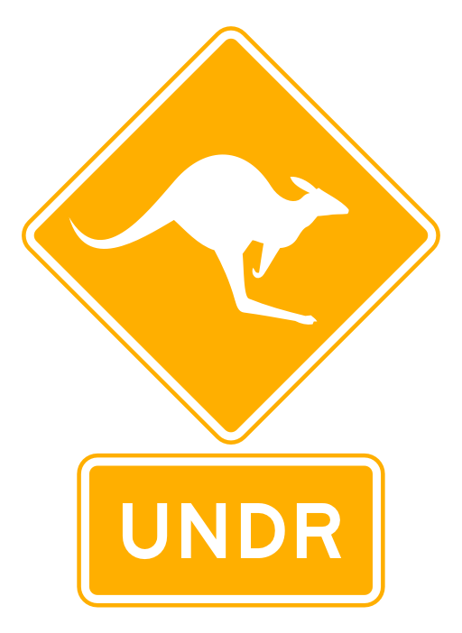

<p align="center">
    
</p>

# Unified Neuromorphic Datasets Repository

Get your data down UNDR.

## Python package

```sh
pip3 install undr
```

## Dataset format specification

## Dataset mirrors


## Publish

1. Bump the version number in *setup.py*.

2. Install twine
```
pip3 install twine
```

3. Upload the source code to PyPI:
```
python3 setup.py sdist
python3 -m twine upload dist/*
```
